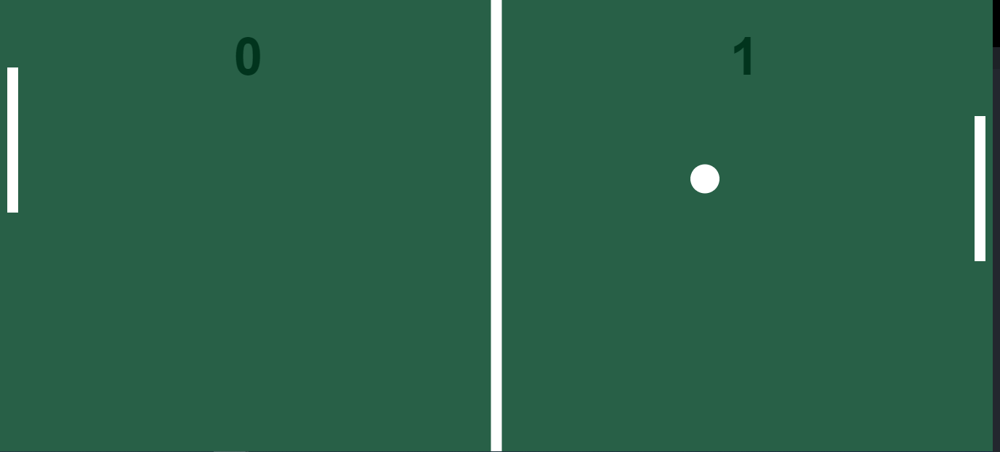

<h1 align="center"> Game Ping Pong em JavaScript</h1>

Criação do jogo ping pong para treinar a lógica de programação e os conceitos básico da linguagem.

  <a href="#-tecnologias">Tecnologias</a>&nbsp;&nbsp;&nbsp;|&nbsp;&nbsp;&nbsp;
  <a href="#-projeto">Projeto</a>&nbsp;&nbsp;&nbsp;|&nbsp;&nbsp;&nbsp;
  <a href="#memo-licença">Licença</a>

  

 

  

## 🚀 Tecnologias

Esse projeto foi desenvolvido com as seguintes tecnologias:

- HTML
- JavaScript
- Canvas
- API requestAnimationFrame 
- Git e Github

## 💻 Projeto

Game Ping Pong Jogador contra o computador, projeto para treinar lógica de programação, aprimorar os conceitos da linguágem, projeto desenvolvido no curso DevSamurai.

## :memo: Licença

Esse projeto está sob a licença MIT.

---

Feito junto com ♥ by [DevSamurai](https://class.devsamurai.com.br/)

---

## Autor
Jair Torezone Euzebio Ribeiro

https://www.linkedin.com/in/jair-torezone/
---
